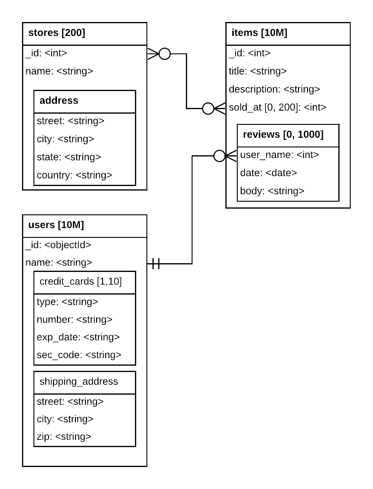
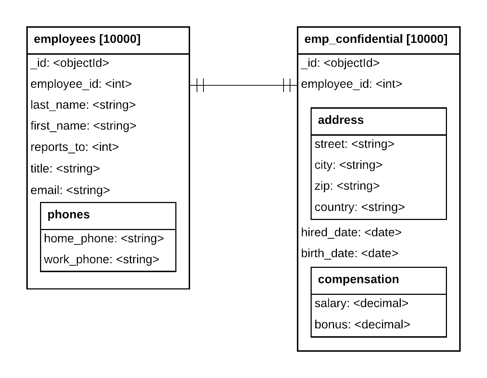

# 02 Relationships

## Lab: Many-to-Many Relationship
**Problem**:
Given the following Collection Relationship Diagram (CRD), identify the relationships that represent Many-to-Many relationships.

We are asking you to identify not only direct Many-to-Many relationships, but also transitives ones. For example a user has a One-to-Many relationship with its reviews and a One-to-Many relationship with its credit cards, making a Many-to-Many relationship between the reviews and the credit cards.

**Answer**: 
1. *items.sold_at* and *items.reviews.body*
2. *stores.address.street* and *items.description*
3. *users.credit_card.number* and *items.reviews.body*

## Lab: One-to-One Relationship
**Problem**:
A legacy database has been ported to MongoDB, resulting in a set of collections that were mapped to their original tables. This port has been quickly identified as a poor solution.

We have been tasked with redesigning the employees collection to make better use of the document model to make the information clearer.

While we are restructuring the database, the Human Resources department would like us to move any confidential employee information to a different collection to make the information easier to protect.

Consider the following potential schema designs. Each of these designs represents an individual employee and the One-to-One relationship between all of their fields.

The ideal schema design should store:
- address information together as an embedded sub-document
- all of an employee's phone numbers together as an embedded sub-document
- all salary and bonus compensation information together as an embedded sub-document
- all confidential information in a separate collection
  
Once you've identified the ideal design, you can deepen your knowledge by trying to explain why each of the other options is not the preferred design choice.

**Answer**: 
